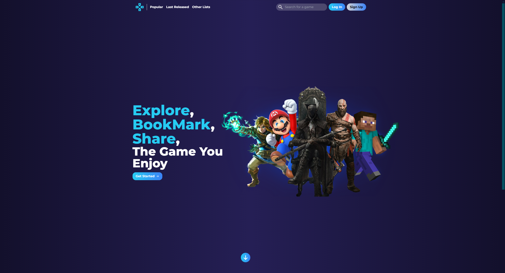
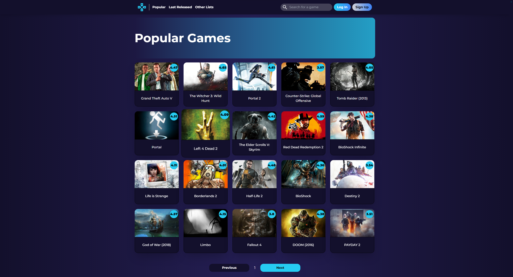
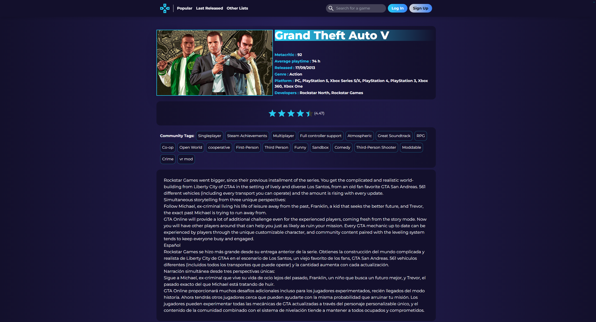
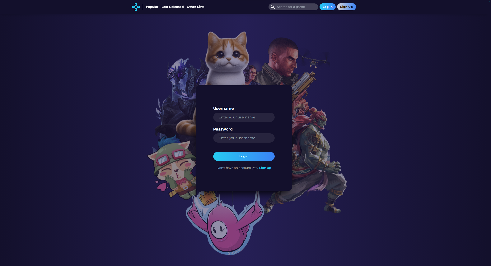
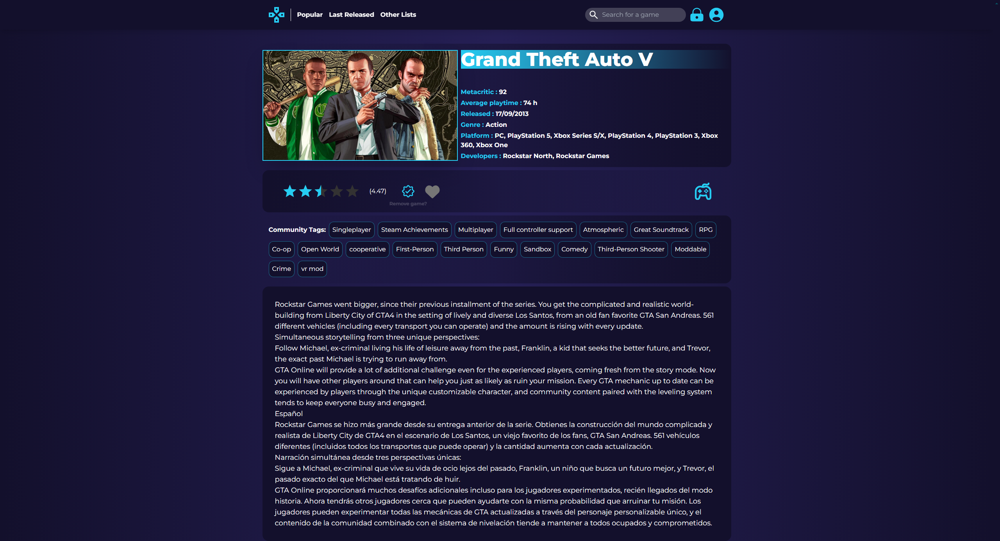

# PlayLog

Bienvenue sur PlayLog, votre plateforme de suivi de jeux vidéo inspirée de Letterboxd !

## Description

PlayLog est un site web qui permet aux utilisateurs de suivre, de noter et d'organiser leurs jeux vidéo de la même manière que Letterboxd le fait pour les films. Vous pouvez créer une liste personnalisée de jeux auxquels vous avez joué, les jeux que vous voulez jouer, ceux que vous avez terminés, et plus encore. De plus, vous pouvez attribuer des notes et marquer vos jeux préférés.

## Fonctionnalités

- **Liste de jeux :** Créez des listes personnalisées pour suivre les jeux que vous avez joués, que vous voulez jouer, que vous avez terminés, etc.
- **Notation :** Attribuez une note à chaque jeu pour exprimer votre opinion.
- **Statut de jeu :** Indiquez si vous avez joué à un jeu, si vous l'avez terminé.
- **Favoris :** Marquez vos jeux préférés pour les retrouver facilement.
- **Connexion utilisateur :** Connectez-vous pour accéder à des fonctionnalités avancées comme la sauvegarde de vos listes et notes.

## Utilisation

1. **Inscription/Connexion :** Créez un compte ou connectez-vous à votre compte existant.
2. **Recherche de jeux :** Utilisez la fonction de recherche pour trouver les jeux que vous souhaitez ajouter à votre liste.
3. **Ajout à la liste :** Une fois sur la page d'un jeu, ajoutez-le à votre liste en choisissant le statut correspondant (joué, à jouer, terminé, etc.).
4. **Notation et commentaires :** Attribuez une note au jeu et ajoutez des commentaires pour partager votre expérience.
5. **Gestion de liste :** Consultez et gérez vos listes depuis votre profil.

## Captures d'écran

### Accéder aux jeux les plus populaires au sein de la communauté:

### Avoir plus de détail sur un jeu:

### La majorité des fonctionnalités du site se débloque une fois que vous êtes connectés:

### Par exemple, maintenant sur la page d'un jeu vous avez accès à la notations et à l'ajout dans votre liste:

## Technologies utilisées

- Frontend: ViteJS, React, Tailwind, react-router-dom
- Backend : Express (node.js)
- Base de données : MySQL
- API Externe : rawg.io

## Le lancer chez vous

- Cloner le repo
- Configurez les fichiers .env dans les dossiers /frontend et /backend en suivant les exemples fournis
- Se fournir d'une clé API rawg.io pour le bon fonctionnement du site
- Exécutez dans le terminal depuis la racine du projet : `npm install`
- Puis `npm run dev` pour lancer le tout

## Endpoints API :

### Utilisateur:

- POST /api/users : Sert à la création d'un compte
- POST /api/login : Sert à l'authentification et à l'envoie d'un token avec les infos de l'utilisateurs dans un cookie
- GET /api/logout : Sert à la déconnexion tout en veillant à supprimer le cookie du navigateur de l'utilisateur
- GET /api/users/:id : Renvoie les infos d'un utilisteurs

### Jeu :

- POST /api/users/played/:id : Ajout d'un jeu si l'utilisateur est connecté dans sa liste
- PUT /api/users/played/:id : Change l'état d'un jeu dans la liste d'un utilisateur (par exemple l'enlever des favoris)
- DELETE /api/list/:gameId : Suppression d'un jeu de la liste d'un utilisateur
